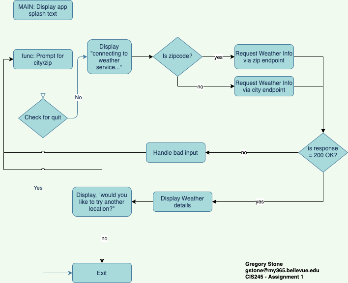

# Week 7 • Git, Peers, and Drafts
This folder contains all the submissions for week 7. Plus a bonus of a fully completed final class project. 

### Git repo
I actually have had my account git account for years and have been paying for the Github Pro tier for my personal stuff. This particular repo I created in the second week of the course to keep all my code off my mac in a safe place. *So here it is!*

### peerReviewFixed.py
This file is assignment 7.2 and submitted as part of assigment 7.1 to create the repo.

### Open Weather Class Project
The flow of the final project is shown below:

There are two files in this repo:

ClassProject-draft.py

ClassProject.py

It was necessary because in the world of code there is no such thing as a draft. Code either compiles or it doesn't. Then it either works as intended or it doesn't. I have no idea what a draft is. 

When I program I typically start out with a version of source that includes comments, function stubs, when the language supoprts interfaces I define the interfaces but don't implement the code in any of the implementations. This helps me grok if I am on the right path with abstractions, code organization, program flow, etc. Plus it means I write my documentation first. Next I write my unit tests that should all fail initially.

So, the first file is basically that without the unit tests. The second is the fully working program just in case the Professor expected something to run and output. It was such an easy assignment I wouldn't know where to stop and say, that is *drafty* enough, so I just wrote the whole thing in an hour.