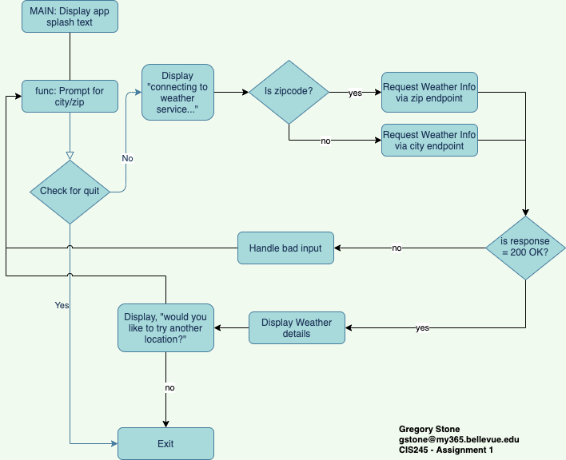

# Week 7 • Git, Peers, and Drafts
This folder contains all the submissions for week 7. Plus a bonus of a fully completed final class project. 

### Git repo
I actually have had my account git account for years and have been paying for the Github Pro tier for my personal stuff. This particular repo I created in the second week of the course to keep all my code off my mac in a safe place. *So here it is!*

### peerReviewFixed.py
This file is assignment 7.2 and submitted as part of assigment 7.1 to create the repo.

### Open Weather Class Project
The flow of the final project is shown below:



The file ClassProject-draft.py is really a complete working program that mostly follows the above flow chart.
To run type `python ClassProject-draft.py` in a terminal or cmd shell.

### Sample output
```
__    __   ___  ____ ______ __ __   ___ ____        ___  ____       ____   ___  ______ 
|  |__|  | /  _]/    |      |  |  | /  _|    \      /   \|    \     |    \ /   \|      |
|  |  |  |/  [_|  o  |      |  |  |/  [_|  D  )    |     |  D  )    |  _  |     |      |
|  |  |  |    _|     |_|  |_|  _  |    _|    /     |  O  |    /     |  |  |  O  |_|  |_|
|  `  '  |   [_|  _  | |  | |  |  |   [_|    \     |     |    \     |  |  |     | |  |  
 \      /|     |  |  | |  | |  |  |     |  .  \    |     |  .  \    |  |  |     | |  |  
  \_/\_/ |_____|__|__| |__| |__|__|_____|__|\_|     \___/|__|\_|    |__|__|\___/  |__|  
                                                                                        
--------------------------------------------------------------------------------------------
Welcome to Weather or Not, the real-time weather service tool.


Enter your location in one of the following ways:
City, Country e.g. Milan, Italy
City, State, Country e.g. Cupertino, CA, US
 or a US zipcode e.g. 95050
type [Q]uit to exit.

Get weather for: 95014
        Connecting to weather service...

The weather for Cupertino,US is:
Temperature of 48.04° with haze, with winds at 3.36mph and 81% humidity.

Get weather for: Boston,MA,US
        Connecting to weather service...

The weather for Boston,US is:
Temperature of 35.56° with scattered clouds, with winds at 23.04mph and 51% humidity.

Get weather for: Q
Goodbye!
```