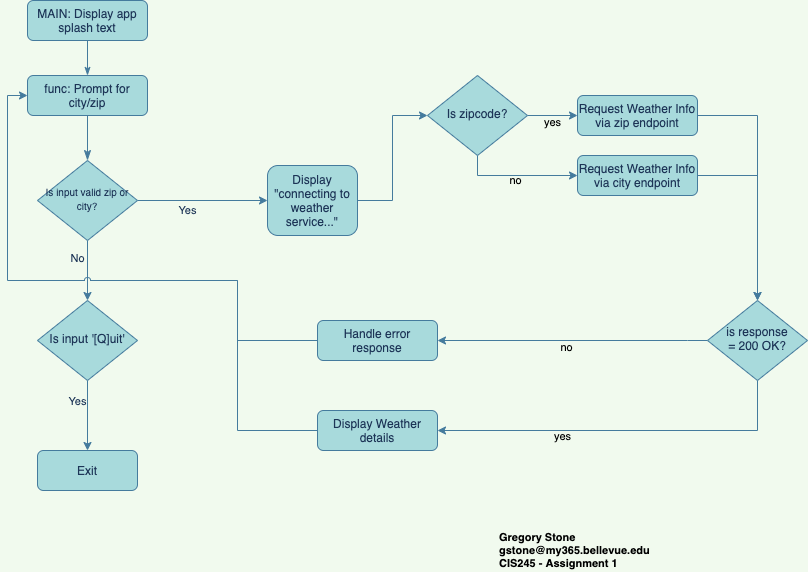

# Week 9 • Final Open Weather Class Project
This folder contains the final version of the class project weather API program. The flowchart from week 3 of the final project is shown below:



To run type `python ClassProject-final.py` in a terminal or cmd shell.

### Sample output
```
__    __   ___  ____ ______ __ __   ___ ____        ___  ____       ____   ___  ______ 
|  |__|  | /  _]/    |      |  |  | /  _|    \      /   \|    \     |    \ /   \|      |
|  |  |  |/  [_|  o  |      |  |  |/  [_|  D  )    |     |  D  )    |  _  |     |      |
|  |  |  |    _|     |_|  |_|  _  |    _|    /     |  O  |    /     |  |  |  O  |_|  |_|
|  `  '  |   [_|  _  | |  | |  |  |   [_|    \     |     |    \     |  |  |     | |  |  
 \      /|     |  |  | |  | |  |  |     |  .  \    |     |  .  \    |  |  |     | |  |  
  \_/\_/ |_____|__|__| |__| |__|__|_____|__|\_|     \___/|__|\_|    |__|__|\___/  |__|  
                                                                                        
--------------------------------------------------------------------------------------------
Welcome to Weather or Not, the real-time weather service tool.


Enter your location in one of the following ways:
City, Country e.g. Milan, Italy
City, State, Country e.g. Cupertino, CA, US
 or a US zipcode e.g. 95050
type [Q]uit to exit.

Get weather for: Rogers,AR,US
        Connecting to weather service...connection successful.
The weather for Rogers,US is:
Temperature of 28.44° with overcast clouds, with winds at 10.29mph and 86% humidity.

Get weather for: 95050
        Connecting to weather service...connection successful.
The weather for Santa Clara,US is:
Temperature of 51.48° with few clouds, with winds at 4.7mph and 47% humidity.

Get weather for: Q
Goodbye!
```
